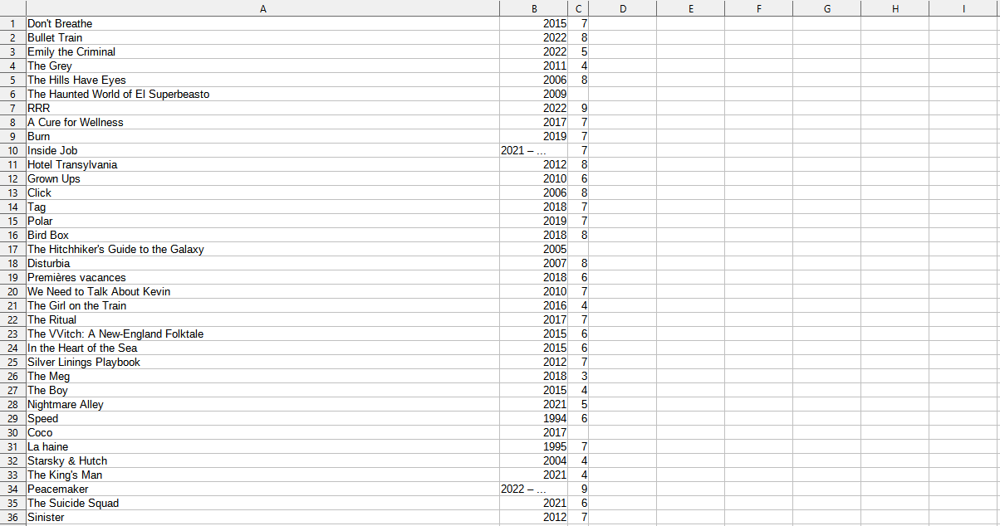

## Description

Extracts all your movie rates on Kinopoisk.ru to the csv file.

## Installation

Requires Chrome v.106 and Selenium webdriver

## Usage

- **Run the script**
- **Login**
- **Go to watched movies folder**
- **Choose the largest number of displayed movies per page** - time period within which new offers are displayed (in minutes)
- **Wait for a minute**

## Contributing
Pull requests are welcome. For major changes, please open an issue first to discuss what you would like to change.

Please make sure to update tests as appropriate.

## License
[MIT](https://choosealicense.com/licenses/mit/)